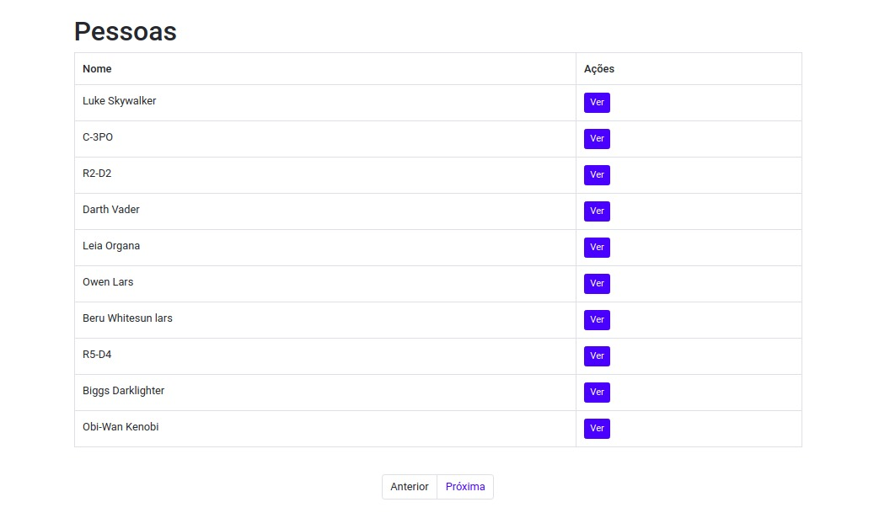
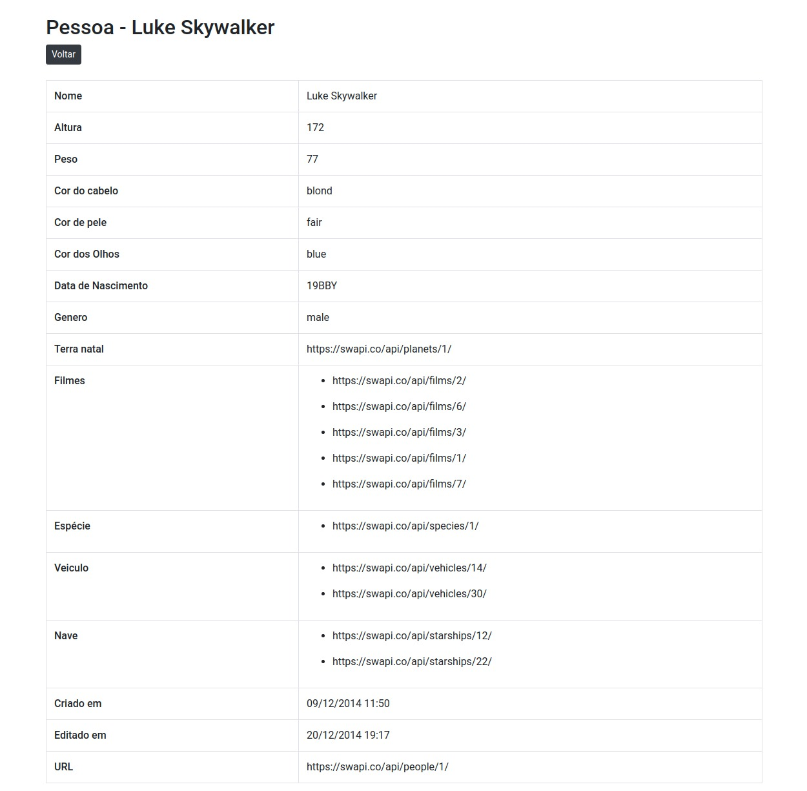

Assim como as empresas de TI estão fazendo, nós também estamos proporcionando um desafio para avaliarmos e ajudar a evoluir.

## Bora participar do projeto com maior taxa de *empregabilidade*?!!!

Aqui não exigimos experiência, pois é aqui que você adquirá.
Mas precisamos que tenha um conhecimento em lógica, o resto é fácil de aprender.

*Precisamos de pessoas para as seguintes áreas:*
------

* Levantamento e Análise de requisitos
* Projeto
* Desenvolvimento
* Testes
* Deploy
* Manutenção

Sim, um time de desenvolvimento de software não é compostos apenas por codificadores,
por isso você pode partipar sem mexer em códigos, como designers de UI e UX.

## O desafio é

Com base nas imagens, e API abaixo:

- [Lista] https://swapi.co/api/people/

- [Detalhes] https://swapi.co/api/people/?page=2

## Para:

- **Desenvolvedores frontend (mobile ou web)**: criar o front consumindo a API, as lista de pessoas e detalhes de pessoa. O front pode ser construido usando ReactJS, Angular, React Native, Flutter, Android ou swift. Diferenciais que serão avaliados: código limpo, criatividade no desenvolvimento da tela. Clicando no link abaixo você terá acesso aos repositórios para o desafio.

- https://github.com/lds-ulbra-torres/desafio-frontend-reactjs
- https://github.com/lds-ulbra-torres/desafio-front-angular
- https://github.com/lds-ulbra-torres/desafio-react-native
- https://github.com/lds-ulbra-torres/desafio-flutter
- https://github.com/lds-ulbra-torres/desafio-android
- https://github.com/lds-ulbra-torres/desafio-swift

- **Backend**: com base nos dados da API acima, construir uma api com CRUD(criar, ler, alterar, deletar), pode ser construida utilzando PHP ou Node.js. Diferenciais que serão avaliados: código limpo, padrão de projeto, testes automatizados, docker. Clicando no link abaixo você terá acesso aos repositórios para o desafio.

- https://github.com/lds-ulbra-torres/desafio-backend-nodejs
- https://github.com/lds-ulbra-torres/desafio-php

- **Fullstack**: faça tudo acima.

- **Designers**: sugerir um novo layout para lista de pessoas e detalhes de pessoa.

- **Testers**:  no sitema http://site-teste-aslave-org-br.umbler.net/#/entradas (login: admin e password: add), fazer o teste dos seguites casos:

**Primeiro**
> **SENDO** o almoxarife 

> **POSSO** cadastrar as entradas de produtos que possuem dois tipos:  Doação ou Compra.

> **PARA QUE** eu possa lançar o produto no estoque. Saber qual dia e  qual produto entrou e como entrou por datas.

 **restrições**
> A lista de itens não sofre update. Apenas insert e delete.
> fazer um sincroniza lista para quando for feito um update no objeto  entrada, pelo front.
> o campo tipo de entrada é um int no back. os códigos sao: 1 compra -> 2 doação 
> os itens não podem ser 
> - o usuário seleciona uma pessoa, o tipo de entrada (compra ou doação)> , informa a data e adiciona os itens na lista. Pode incluir e deletar > itens na lista e salvar o pedido. 
> - pode excluir um pedido
> - pode alterar um pedido, adicionando mais itens ou deletando itens. 

**Segundo**

>**SENDO** o almoxarife 

>**POSSO** cadastrar as saídas de produtos

>**PARA QUE** eu possa tirar o produto do estoque e o porquê saiu do estoque. Saber qual dia e qual produto sai por grupo e data.

O desafio proposto deve ser realizado até 21 de agosto de 2019.

## Contatos:

- cassio.huggentobler@rede.ulbra.br
- daniela.schutt@rede.ulbra.br
- joziel.santos@rede.ulbra.br
